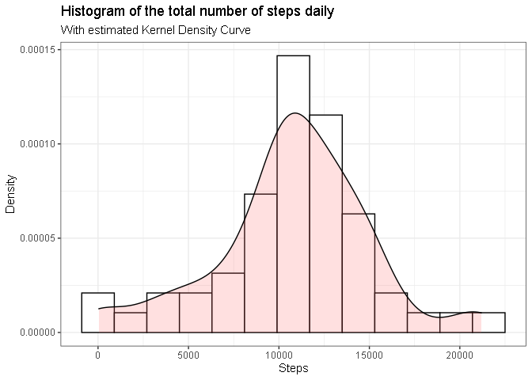
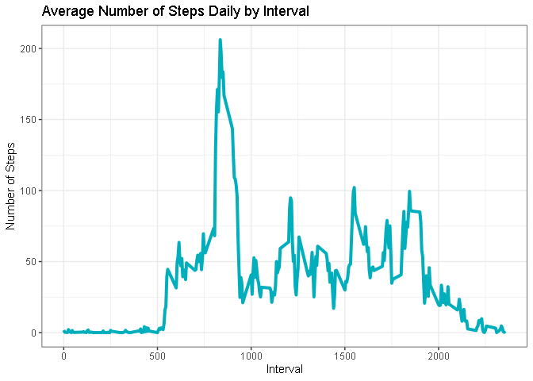
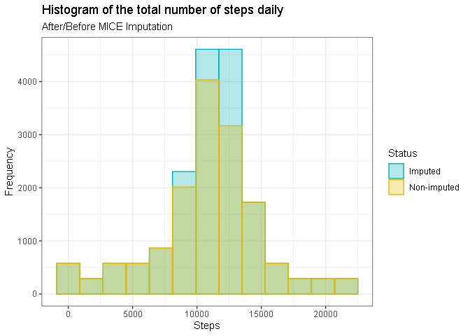
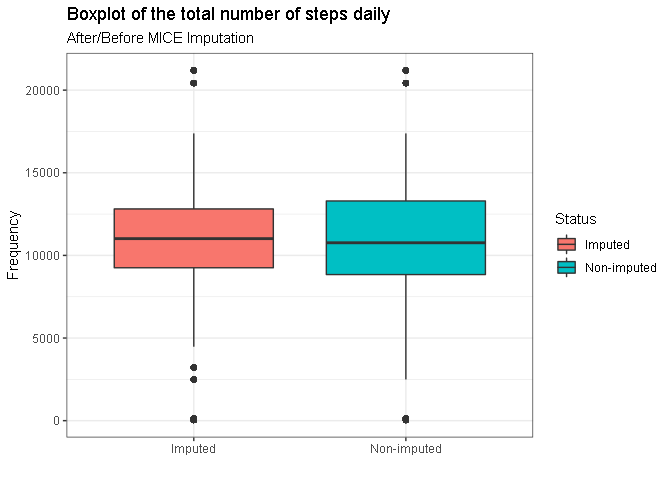
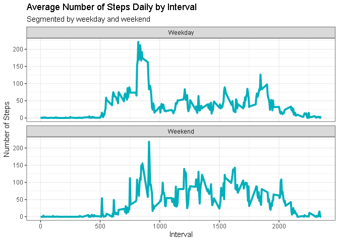

## Libraries


```r
require(tidyverse)
require(mice)
require(lubridate)
```


## Loading and preprocessing the data

Let's unzip the `activity.zip` file with the `unzip` function from `utils` package and read the data file with `read_csv` from `readr` package, producing a *tibble* dataframe.


```r
if(file.exists('./activity.zip')) {
  # Extract Data file
  unzip('./activity.zip')
  # Load Data file in tibble dataframe
  data <- read_csv('activity.csv')
  # Delete Data file
  invisible(file.remove('./activity.csv'))
}
```

Let's view the data head in knitr kable table format


```r
knitr::kable(head(data), 
             col.names = str_to_title(names(data))) # capitular colnames format
```


| Steps|Date       | Interval|
|-----:|:----------|--------:|
|    NA|2012-10-01 |        0|
|    NA|2012-10-01 |        5|
|    NA|2012-10-01 |       10|
|    NA|2012-10-01 |       15|
|    NA|2012-10-01 |       20|
|    NA|2012-10-01 |       25|


## What is mean total number of steps taken per day?

Let's look at the histogram of the total number of steps performed daily. But, let's replace the count on the y-axis with the density values and thus plot the density kernel as well.


```r
data %>%
  group_by(date) %>%
  summarise(sm = sum(steps)) %>%
  ggplot(aes(x = sm)) +
  geom_histogram(aes(y = ..density..), binwidth = 1800, 
                 color = "black", fill = "white") +
  geom_density(alpha = 0.2, fill = "#FF6666") +
  theme_bw() + labs(title = 'Histogram of the total number of steps daily', subtitle = 'With estimated Kernel Density Curve') + xlab('Steps') + ylab('Density') 
```

<!-- -->

Let's look at the mean and median of the total number of steps performed daily.


```r
data %>%
  group_by(date) %>%
  summarise(sm = sum(steps)) %>%
  ungroup() %>%
  summarise(Mean = mean(sm, na.rm = T),
            Median = median(sm, na.rm = T))
```

```
## # A tibble: 1 x 2
##     Mean Median
##    <dbl>  <dbl>
## 1 10766.  10765
```


## What is the average daily activity pattern?

Let's look at the time series plot of the average number of steps per 5-minute interval


```r
data %>%
  group_by(interval) %>%
  summarise(sm = mean(steps, na.rm = T)) %>%
  ggplot(aes(interval, sm)) +
  labs(title = 'Average Number of Steps Daily by Interval') +
  ylab('Number of Steps') + xlab('Interval') +
  geom_line(col = "#00AFBB", size = 1.4) + theme_bw()
```

<!-- -->

Let's find out which 5 minute interval has the highest average daily steps *sm* (step mean)


```r
data %>%
  group_by(interval) %>%
  summarise(interval, sm = mean(steps, na.rm = T)) %>%
  ungroup() %>%
  dplyr::filter(sm == max(sm, na.rm = T)) %>%
  distinct()
```

```
## # A tibble: 1 x 2
##   interval    sm
##      <dbl> <dbl>
## 1      835  206.
```


## Imputing missing values

We have several lines with missing values (NA), let's check the count of these values by row


```r
data %>%
  summarise(na_count = sum(!complete.cases(.)))
```

```
## # A tibble: 1 x 1
##   na_count
##      <int>
## 1     2304
```

One strategy that we can use is that of imputation by MICE (Multiple Imputation by Chained Equations), basically it tries to interactively predict each missing value by means of a regression. The figure below exemplifies the process


Let's impute the missing data with the mice function and
create a new dataframe `data_imputed` that will have the new data.


```r
temp_data <- mice(data, m = 50, meth = 'pmm', # 50 datasets and predictive mean method
                  seed = 500, printFlag = F) 
data_imputed <- complete(temp_data, 1)
```

After imputing the data we will see the histogram of the data before and after imputation


```r
data %>%
  mutate(Status = rep_along(steps, 'Non-imputed')) %>%
  bind_rows(., data_imputed %>%
              mutate(Status = rep_along(steps, 'Imputed'))) %>%
  group_by(Status, date) %>%
  summarise(Status, date, sm = sum(steps)) %>%
  ggplot(aes(x = sm)) +
  geom_histogram(aes(color = Status, fill = Status), 
                 alpha = 0.3, position = "identity", 
                 binwidth = 1800) +
  scale_fill_manual(values = c("#00AFBB", "#E7B800")) +
  scale_color_manual(values = c("#00AFBB", "#E7B800")) +
  theme_bw() + 
  labs(title = 'Histogram of the total number of steps daily',
       subtitle = 'After/Before MICE Imputation') +
  xlab('Steps') + ylab('Frequency') 
```

<!-- -->

It seems that there were not many changes in the appearance of the histograms, we had a higher concentration of data imputed in the middle area.

Let's check the mean and median statistics


```r
data %>%
  mutate(Status = rep_along(steps, 'Non-imputed')) %>%
  bind_rows(., data_imputed %>%
              mutate(Status = rep_along(steps, 'Imputed'))) %>%
  group_by(Status, date) %>%
  summarise(sm = sum(steps)) %>%
  summarise(Status, Mean = mean(sm, na.rm = T),
            Median = median(sm, na.rm = T)) %>%
  distinct()
```

```
## # A tibble: 2 x 3
## # Groups:   Status [2]
##   Status        Mean Median
##   <chr>        <dbl>  <dbl>
## 1 Imputed     10849.  11015
## 2 Non-imputed 10766.  10765
```

It is notable that the imputation shifted the mean and median of the original data to the right. However, we can actually visually perceive the impact of imputation on the estimation of the total number of steps through a boxplot graph.


```r
data %>%
  mutate(Status = rep_along(steps, 'Non-imputed')) %>%
  bind_rows(., data_imputed %>%
              mutate(Status = rep_along(steps, 'Imputed'))) %>%
  group_by(Status, date) %>%
  summarise(Status, date, sm = sum(steps)) %>%
  ggplot(aes(y = sm, x = Status)) +
  geom_boxplot(aes(fill = Status)) +
  labs(title = 'Boxplot of the total number of steps daily',
       subtitle = 'After/Before MICE Imputation') +
  xlab('') + ylab('Frequency') + theme_bw()
```

<!-- -->

Note how the data variability became smaller after imputation  (size of the box)  and there was a slight increase in the median value (line inside the box). 

Imputation positively affects the mean estimate (increases the mean) and reduces the variability of the data... This can be a problem because, if the imputation is wrong, the reduced variability provides very narrow confidence intervals with a biased estimated mean.

## Are there differences in activity patterns between weekdays and weekends?

Let's look at the graph of the intervals every 5 min daily and the average number of steps per weekday and weekends


```r
data_imputed %>%
  mutate(dayw = if_else(wday(date) %in% c(1,7), # create factor variable
                        "Weekend", "Weekday")) %>%
  group_by(interval, dayw) %>%
  summarise(dayw, interval, sm = mean(steps, na.rm = T)) %>% 
  ggplot(aes(interval, sm)) +
  labs(title = 'Average Number of Steps Daily by Interval',
       subtitle = 'Segmented by weekday and weekend') +
  ylab('Number of Steps') + xlab('Interval') +
  geom_line(col = "#00AFBB", size = 1.4) + 
  facet_wrap(~dayw, ncol = 1) + theme_bw()
```

<!-- -->

